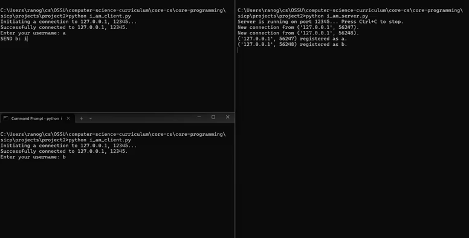

### This is a tcp/ip application.

- Server. 
Listens on a non-blocking socket, handling multiple clients with threads.
Gracefully shuts down with Ctrl+C using a global shutdown flag.

- Concurrency.
Each client is handled in a separate thread.

- Socket Management.
Uses select.select() for non-blocking I/O and timeout.

- Client.
Connects to the server, sends and receives messages concurrently.
The above is the init state of the application.

Tasks:
1. Invent the capability to send a message to a list of clients as well as to a single client. Do this entirely in the client program, so what actually goes to the server is multiple requests.
    1.1 
    Standardized the messaging format to be SEND recipient:message 
    server is able to echo to the recipent the message
    1.2
    Clients can send messages to each other 
    enabled threading on clientside 
    1.3
    Client cand send messages to multiple clients within one request.

2. Invent the capability to broadcast a message to every client. Do this by inventing a broadcast command that the server understands.
    2.1 if client exits it receives a message
    2.2 if client equal to repient the message is ignored
    
3. Could #1 have been done with the server doing part of the work? 
   Could #2 have been done entirely in the client code? Compare the virtues of the two approaches.
   #1 yes, I've implimented it using server side work
   #2 I think it could but it would introduce unnecessary complexity 
4. Invent the capability of refusing messages from specific people. The sender of a refused message should be notified of the refusal. 
Decide whether to do it entirely in the client or with the server’s cooperation, and explain why. 
   4.1 client can block a single client
   4.2 cliend can block multiple clients
   4.3 when a client disconnect all blocked recipients are erased
5. Why is the 3-way handshake necessary when connecting to the server?
   5.1 to better inform each side about the connection
   

#### bugfixes:
- 27/02/2025:
server side was checking user in blocked instead of clients, which implied a impossible way to send a message to a connected client